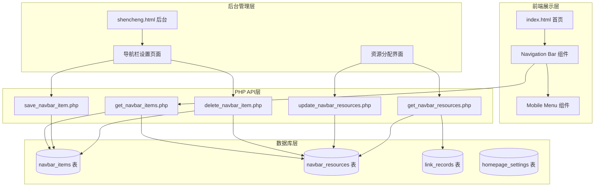

# Design Document

## Overview

本设计文档描述网盘资源分享站导航栏管理系统的技术实现方案。系统采用PHP后端 + MySQL数据库 + 原生JavaScript前端的技术栈，与现有系统保持一致。导航栏功能包括前台展示组件和后台管理界面两部分。

## Architecture



## Components and Interfaces

### 1. 前端组件

#### 1.1 Navigation Bar Component (导航栏组件)
- 位置：index.html 头部下方
- 功能：显示导航项目列表，支持点击筛选
- 样式：与现有设计风格一致，使用玻璃态效果
- 默认项：首个导航项为"全部"，点击显示所有资源

#### 1.2 Mobile Menu Component (移动端菜单)
- 触发：viewport < 768px 时显示汉堡图标
- 动画：slide-down 展开效果
- 交互：点击外部或选择项目后自动收起

#### 1.3 Section Title Component (资源列表标题)
- 位置：资源列表区域上方
- 动态显示：
  - 默认/点击"全部"时显示：`资源列表（全部）`
  - 点击某个导航时显示：`资源列表（{导航名称}）`
- 图标：保持现有的火焰图标 `<i class="fas fa-fire"></i>`

### 2. 后端API接口

#### 2.1 get_navbar_items.php
```php
// 获取所有导航项目
// GET 请求
// 返回: { success: true, data: [{ id, name, sort_weight, resource_count }] }
```

#### 2.2 save_navbar_item.php
```php
// 创建或更新导航项目
// POST 请求
// 参数: { id?: number, name: string, sort_weight?: number }
// 返回: { success: true, id: number }
```

#### 2.3 delete_navbar_item.php
```php
// 删除导航项目
// POST 请求
// 参数: { id: number }
// 返回: { success: true }
```

#### 2.4 update_navbar_resources.php
```php
// 更新导航项目的资源关联
// POST 请求
// 参数: { navbar_id: number, resource_ids: number[] }
// 返回: { success: true }
```

#### 2.5 get_navbar_resources.php
```php
// 获取导航项目关联的资源
// GET 请求
// 参数: navbar_id (可选，不传则返回所有资源及其导航关联)
// 返回: { success: true, data: [{ resource_id, custom_name, navbar_ids: [] }] }
```

#### 2.6 get_homepage_resources.php (修改现有)
```php
// 增加 navbar_id 参数支持
// GET 请求
// 参数: page, search, navbar_id (可选)
// 返回: 按导航筛选的资源列表
```

### 3. 后台管理界面

#### 3.1 导航栏设置入口
- 位置：shencheng.html 中的 nav-links 区域
- 新增：导航栏设置 tab

#### 3.2 导航管理界面
- 导航列表：显示所有导航项目，支持编辑、删除、排序
- 创建表单：输入导航名称创建新导航
- 资源分配：展开导航项目后显示资源勾选列表

## Data Models

### 1. navbar_items 表 (新建)

| 字段 | 类型 | 说明 |
|------|------|------|
| id | INT AUTO_INCREMENT | 主键 |
| name | VARCHAR(100) | 导航名称 |
| sort_weight | INT DEFAULT 0 | 排序权重，越大越靠前 |
| create_time | DATETIME | 创建时间 |
| update_time | DATETIME | 更新时间 |

```sql
CREATE TABLE `navbar_items` (
  `id` int(11) NOT NULL AUTO_INCREMENT,
  `name` varchar(100) COLLATE utf8mb4_unicode_ci NOT NULL COMMENT '导航名称',
  `sort_weight` int(11) DEFAULT '0' COMMENT '排序权重',
  `create_time` datetime DEFAULT CURRENT_TIMESTAMP,
  `update_time` datetime DEFAULT CURRENT_TIMESTAMP ON UPDATE CURRENT_TIMESTAMP,
  PRIMARY KEY (`id`)
) ENGINE=MyISAM DEFAULT CHARSET=utf8mb4 COLLATE=utf8mb4_unicode_ci COMMENT='导航栏项目表';
```

### 2. navbar_resources 表 (新建)

| 字段 | 类型 | 说明 |
|------|------|------|
| id | INT AUTO_INCREMENT | 主键 |
| navbar_id | INT | 导航项目ID |
| resource_id | INT | 资源ID (link_records.id) |
| create_time | DATETIME | 创建时间 |

```sql
CREATE TABLE `navbar_resources` (
  `id` int(11) NOT NULL AUTO_INCREMENT,
  `navbar_id` int(11) NOT NULL COMMENT '导航项目ID',
  `resource_id` int(11) NOT NULL COMMENT '资源ID',
  `create_time` datetime DEFAULT CURRENT_TIMESTAMP,
  PRIMARY KEY (`id`),
  UNIQUE KEY `unique_navbar_resource` (`navbar_id`, `resource_id`),
  KEY `idx_navbar_id` (`navbar_id`),
  KEY `idx_resource_id` (`resource_id`)
) ENGINE=MyISAM DEFAULT CHARSET=utf8mb4 COLLATE=utf8mb4_unicode_ci COMMENT='导航栏资源关联表';
```

### 3. homepage_settings 表 (修改现有)

新增设置项：
```sql
INSERT INTO `homepage_settings` (`setting_key`, `setting_value`, `setting_description`) VALUES
('navbar_enabled', '0', '是否开启导航栏');
```


## Correctness Properties

*A property is a characteristic or behavior that should hold true across all valid executions of a system-essentially, a formal statement about what the system should do. Properties serve as the bridge between human-readable specifications and machine-verifiable correctness guarantees.*

### Property 1: Navbar visibility based on setting
*For any* homepage load, the navigation bar component SHALL be present in the DOM if and only if the navbar_enabled setting is "1" in the database.
**Validates: Requirements 1.1, 3.3**

### Property 2: Resource filtering by navigation
*For any* navigation item ID and set of resources in the database, when filtering by that navigation ID, the returned resources SHALL be exactly those resources that have an association in navbar_resources with that navigation ID.
**Validates: Requirements 1.2**

### Property 3: Section title reflects current filter
*For any* navigation selection, the section title SHALL display "资源列表（全部）" when "全部" is selected, or "资源列表（{导航名称}）" when a specific navigation item is selected.
**Validates: Requirements 1.3, 1.4**

### Property 4: Setting persistence round-trip
*For any* navbar_enabled setting value ("0" or "1"), saving the setting and then retrieving it SHALL return the same value.
**Validates: Requirements 3.2**

### Property 5: Navigation creation with validation
*For any* non-empty, non-whitespace navigation name, creating a navigation item SHALL result in a database record with a unique ID, the provided name, and a default sort_weight of 0. *For any* empty or whitespace-only name, creation SHALL fail with a validation error.
**Validates: Requirements 5.1, 5.2, 5.3**

### Property 6: Navigation update persistence
*For any* existing navigation item and valid new name, updating the navigation item SHALL result in the database record reflecting the new name while preserving the ID.
**Validates: Requirements 6.2**

### Property 7: Cascade deletion
*For any* navigation item with associated resources, deleting the navigation item SHALL remove both the navbar_items record AND all related navbar_resources records.
**Validates: Requirements 6.4**

### Property 8: Resource association toggle
*For any* navigation item and resource, checking the association SHALL create a navbar_resources record, and unchecking SHALL remove that record. The association state SHALL be idempotent (checking twice has same effect as checking once).
**Validates: Requirements 7.2, 7.3**

### Property 9: Resource visibility rules
*For any* resource, it SHALL appear on the homepage when show_on_homepage is true, regardless of navigation assignments. When filtering by a specific navigation, only resources with explicit associations to that navigation SHALL appear.
**Validates: Requirements 8.1, 8.2, 8.3**

### Property 10: Sort order consistency
*For any* set of navigation items with different sort_weight values, the items SHALL be displayed in descending order of sort_weight both in the admin panel and on the frontend navigation bar.
**Validates: Requirements 9.1, 9.2, 9.3**

## Error Handling

### Frontend Errors
1. **Network failures**: Display toast notification with retry option
2. **Invalid responses**: Log error and show user-friendly message
3. **Empty navigation name**: Prevent form submission, highlight input field

### Backend Errors
1. **Database connection failure**: Return JSON error response with status code 500
2. **Invalid parameters**: Return JSON error with status code 400 and validation message
3. **Record not found**: Return JSON error with status code 404
4. **Duplicate navigation name**: Allow (no unique constraint on name)

### Error Response Format
```json
{
  "success": false,
  "error": "Error message description",
  "code": "ERROR_CODE"
}
```

## Testing Strategy

### Property-Based Testing Framework
使用 **PHPUnit** 配合 **Eris** (PHP property-based testing library) 进行属性测试。

### Unit Tests
1. API endpoint response format validation
2. Database CRUD operations
3. Input validation functions
4. Sort order calculation

### Property-Based Tests
每个正确性属性对应一个属性测试：

1. **Property 1 Test**: 生成随机的 navbar_enabled 设置值，验证页面渲染结果与设置一致
2. **Property 2 Test**: 生成随机的导航项目和资源关联，验证筛选结果正确
3. **Property 3 Test**: 生成随机设置值，验证保存后读取值相同
4. **Property 4 Test**: 生成随机字符串（包括空字符串和空白字符串），验证创建行为正确
5. **Property 5 Test**: 生成随机导航项目和新名称，验证更新后数据正确
6. **Property 6 Test**: 生成带有资源关联的导航项目，验证删除后关联也被清除
7. **Property 7 Test**: 生成随机的关联操作序列，验证最终状态正确
8. **Property 8 Test**: 生成随机资源和导航关联，验证可见性规则
9. **Property 9 Test**: 生成随机排序权重，验证显示顺序正确

### Test Configuration
- 每个属性测试运行最少 100 次迭代
- 测试注释格式: `**Feature: navbar-management, Property {number}: {property_text}**`

### Integration Tests
1. 完整的导航创建-分配资源-前台显示流程
2. 设置开关对前台的影响
3. 删除导航后资源显示恢复
